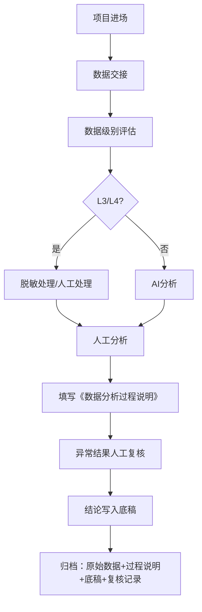

# 融策审计数据分析过程留痕规范

> 适用：全部12条业务线
> 依据：新《注册会计师法》（2027.1实施）"审计全过程资料、数据分析记录属于法定档案"
> 版本：v1.0 | 创建日期：2026-07-14

---

## 一、为什么需要过程留痕

### 法规要求

新《注册会计师法》明确：**AI筛查记录、数据清洗过程、异常分析日志，全部属于法定审计档案。未留存、无溯源依据，直接判定履职失职。**

### 实操含义

每份审计报告背后的数据加工过程，都要能回答三个问题：
1. **数据来源**：原始数据从哪里来？有多少条？时间范围？
2. **处理逻辑**：怎么筛选的？用的什么规则？排除了什么？
3. **判断依据**：为什么这个异常被标记？依据什么法条？

---

## 二、数据分层留痕标准

### 层级一：原始数据层（必须归档）

| 内容 | 格式 | 存档要求 |
|:----|:----|:--------|
| 从被审计单位获取的原始数据 | 原始格式（Excel/PDF/系统导出） | 项目档案中存一份，标注"数据来源" |
| 数据交接清单 | 签字版扫描件 | 附在底稿卷首 |
| 被审计单位承诺书 | 签字版扫描件 | 附在底稿卷首 |

### 层级二：数据处理层（融策标准化模板）

**每个涉及数据分析的项目，必须填写《数据分析过程说明》（模板见附件一）。**

必须记录的内容：
```markdown
1. 数据名称和来源
2. 数据量（行数/记录数）
3. 数据清洗步骤（去重/去空/格式转换等）
4. 分析方法和工具（使用了什么模型/脚本/规则）
5. 关键参数和阈值（如"相似度>90%""偏差>20%"等）
6. 异常结果清单（输出条目数）
7. 人工复核记录（复核人、复核结论、是否调整）
8. 数据操作时间线（什么时间做了什么操作）
```

### 层级三：结论推导层（必须在底稿中体现）

| 审计结论要素 | 留痕要求 |
|:-----------|:--------|
| 事实描述 | 有数据支撑（如"XX专项资金X亿元中，XX万元被挪用于..."） |
| 定性依据 | 有法条引用（具体到条款） |
| 金额计算 | 有计算过程（附数据表或计算公式） |
| 责任认定 | 有决策链条（会议纪要、签字记录） |

---

## 三、数据安全分级制度

### 分级标准

| 级别 | 定义 | 范围 | 处理规则 |
|:----|:----|:----|:--------|
| **L1 公开** | 可公开信息 | 法规政策、公开招标公告、行业标准 | 可用任何AI工具处理 |
| **L2 内部** | 不宜公开的项目信息 | 项目名称、预算金额、实施周期 | 可用私有化AI工具，禁止上传公共大模型 |
| **L3 敏感** | 涉及个人/企业隐私 | 人员名单、身份证号、银行账号、企业工商信息 | 必须脱敏后处理，禁止联网 |
| **L4 涉密** | 审计线索/移送事项 | 移送线索、举报信息、纪委协同数据 | 完全禁止AI处理，纯人工+纸质流转 |

### 各业务线默认数据级别

| 业务线 | 常见数据 | 默认级别 | 特殊说明 |
|:------|:--------|:--------|:--------|
| 经责审计 | 财务数据、会议纪要、干部信息 | L3 | 涉及干部个人事项 → L4 |
| 收支审计 | 支付数据、银行流水 | L3 | 涉及个人银行账户 → L3 |
| 预算执行审计 | 国库支付、预算批复 | L2-L3 | 预算批复可公开 → L2，支付明细 → L3 |
| 专项资金审计 | 社保/低保/补贴发放名单 | L3 | 含大量个人身份信息 |
| 往来款清理 | 对方单位/个人明细 | L3 | 含企业信息 → L3，个人借款 → L3 |
| 招投标审计 | 投标人信息、报价明细 | L2-L3 | 投标人名称 → L2，个人股东信息 → L3 |
| 国企审计 | 财务报表、投资台账 | L2-L3 | 公开报表 → L2，内部运营数据 → L3 |
| 成本效益审计 | 项目投资数据 | L2 | 一般不涉及敏感信息 |
| 能源审计 | 能耗数据、碳排放 | L2 | 一般不涉及敏感信息 |
| 工程审计 | 合同、结算、图纸 | L2-L3 | 合同金额 → L2，含个人签字 → L3 |
| 预算绩效管理 | 绩效目标、评价报告 | L2 | 一般不涉及敏感信息 |
| 政府补贴审计 | 补贴发放名单、面积、GPS | L3 | 含大量个人+土地信息 |

### 执行规则

```
L1 数据 → 可以用任何AI工具
L2 数据 → 只能用本地部署的AI工具（DeepSeek私有化/本地Python脚本）
L3 数据 → 脱敏后处理，禁止联网，禁止上传任何公共API
L4 数据 → 纯人工，纸质流转，不做任何AI处理
```

---

## 四、项目作业流程（含留痕节点）



---

## 附件一：数据分析过程说明（模板）

```markdown
## 数据分析过程说明

### 项目信息
- 项目名称：________________
- 数据来源：________________
- 分析人员：________________
- 复核人员：________________
- 分析日期：________________

### 一、数据概况
| 项目 | 说明 |
|:----|:----|
| 数据名称 |  |
| 数据量 | 共____行/____条记录 |
| 时间范围 | 20__年__月 至 20__年__月 |
| 数据格式 | □Excel □CSV □PDF □系统导出：____ |
| 数据分级 | □L1公开 □L2内部 □L3敏感（已脱敏□） □L4涉密 |

### 二、数据清洗
| 步骤 | 操作说明 | 影响记录数 |
|:----|:--------|:---------|
| 去重 |  | 去除____条 |
| 去空值 |  | 去除____条 |
| 格式转换 |  |  |
| 字段处理 |  |  |
| 其他 |  |  |

### 三、分析方法
| 分析维度 | 工具/模型 | 关键参数 | 输出结果 |
|:--------|:---------|:--------|:--------|
|  |  | 阈值：____ | 共____条异常 |
|  |  | 阈值：____ | 共____条异常 |
|  |  | 阈值：____ | 共____条异常 |

### 四、异常结果清单（摘要）
| 序号 | 异常类型 | 涉及金额 | 涉及单位/个人 | 初步判断 |
|:----|:--------|:--------|:------------|:--------|
| 1 |  |  |  |  |
| 2 |  |  |  |  |
| 3 |  |  |  |  |

### 五、人工复核记录
| 异常项 | 复核人 | 复核结论 | 是否写入底稿 | 备注 |
|:------|:------|:--------|:-----------|:----|
| 1 |  | □确认 □排除 □修改 | □是 □否 |  |
| 2 |  | □确认 □排除 □修改 | □是 □否 |  |
| 3 |  | □确认 □排除 □修改 | □是 □否 |  |

### 六、数据操作时间线
| 时间 | 操作 | 操作人 |
|:----|:----|:------|
|  |  |  |
|  |  |  |
|  |  |  |

---

## 附件二：项目数据安全责任书（模板）

```markdown
## 项目数据安全责任书

项目名称：________________

本人承诺：
1. 已了解本项目数据安全级别为____级
2. 不会将____级及以上数据上传至任何公共网络或公共AI工具
3. 项目结束后，____天内将全部数据（含中间结果）归还或销毁
4. 未经客户书面同意，不保留任何数据副本

承诺人：________  日期：________
```

---

*文件版本: v1.0 | 更新日期: 2026-07-14*
*对应融策四层短板补齐——法规层（过程留痕）+ 合规层（数据安全）*