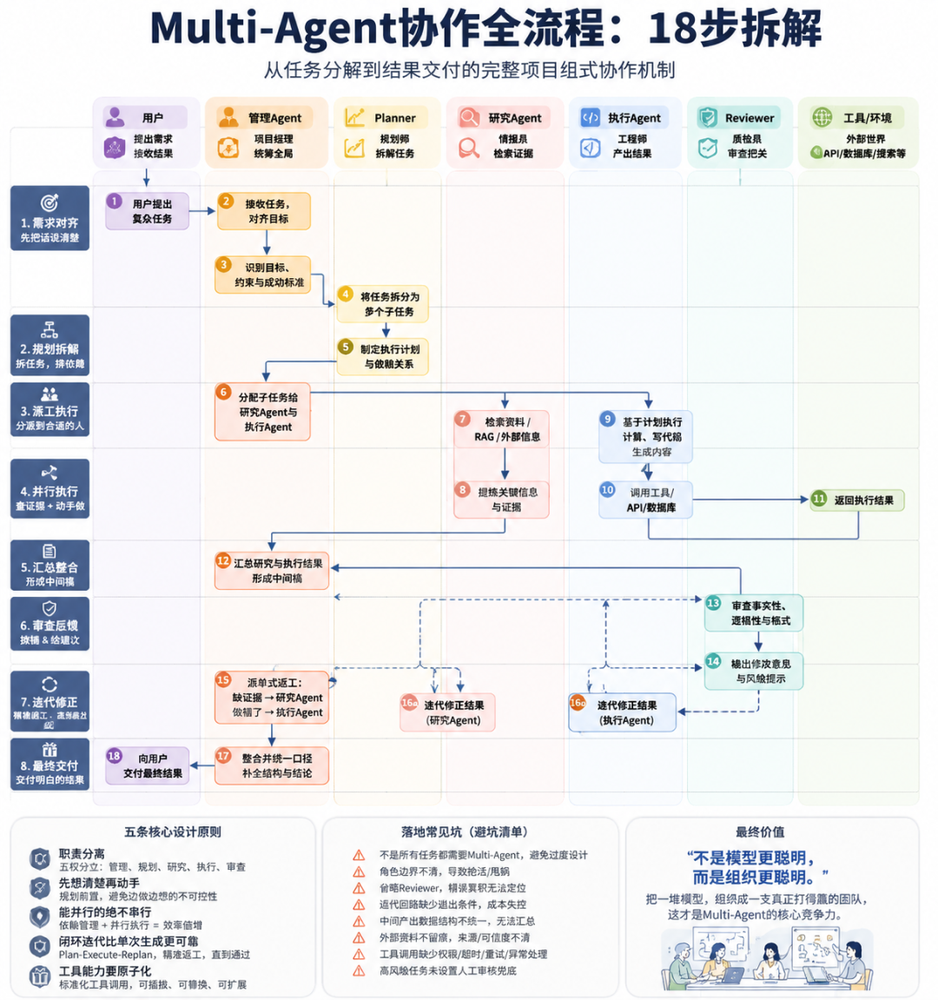

# 一文看懂Multi-Agent：从任务分解到结果交付的18步全流程

**来源**: 未知作者  
**原文链接**: https://mp.weixin.qq.com/s/JBeBU_7QJMS4QGCzHRYewQ  
**爬取时间**: 2026-08-01

---

Multi-Agent 拼的从来不是 模型能力 ，而是 组织能力 ——把一堆模型，组织成一支真正打得赢的团队。
前几天在一个技术群里，有人甩出一句话：“我们现在的Agent就是 三个GPT互相发消息 ，谁先说完谁赢。”
底下一片笑，但笑完我又觉得有点心虚——因为我见过太多号称“Multi-Agent”的项目，拆开一看，确实就是这么回事：几个提示词不同的模型实例，你一句我一句地对话， 靠运气收敛 到一个还算能看的结果。出了问题也 说不清是哪个环节坏的 ，只能整个重跑。
这不是Multi-Agent，这是 排队串行的单Agent，外加一层“多个”的滤镜 。
真正跑得动、扛得住生产环境的多智能体系统，长得完全不是这样。它更像一个运转正常的项目组：有人对齐需求，有人拆解任务，有人查资料，有人干活，还有人专门挑刺。今天想借一张我最近整理的流程图，把这套 “项目组式”的协作机制 掰开揉碎讲清楚——从用户扔出一个复杂任务，到最后拿到一份靠谱的答案，中间到底发生了什么。
📌 本文看点
01
七个岗位怎么分工
02
18步全流程拆解
03
五条原则与落地坑
01PAIN POINTS
单Agent的三个坎，迈不过去
先说说为什么单一Agent在复杂任务上容易翻车，这不是理论问题， 是我自己踩过的坑 。
第一个坎是上下文迟早会崩。 任务稍微长一点、步骤稍微多一点，前面收集的信息、做出的决策，后面就开始互相打架。模型不是没记性，是 记性会被冲淡 ，越往后越像在“凭印象”办事。
第二个坎是角色错位。 一个Agent既要自己想方案、自己写代码，又要自己判断这个方案好不好——这就好比让一个人 同时当运动员和裁判 ，你猜他会不会吹黑哨给自己？不是它故意的，是 结构上就没有制衡 这回事。
第三个坎最要命，叫 错误累积 。 一步错了没人拦，下一步接着错，错误 像滚雪球一样往后传 ，到交付的时候已经积重难返，而且你根本定位不出问题出在哪一环。
这三个坎背后其实是同一句话：
「没有结构的智能，只是更贵的随机性。」
你堆再多算力、换再强的模型，只要 缺了分工和复核 ，翻车是迟早的事。
Multi-Agent真正想解决的，就是这件事——不是“让更多模型一起干活”，而是 给智能装上组织结构 。
02SEVEN ROLES
先认清这七个“岗位”
在讲流程之前，得先把“人”认全，不然后面看步骤会晕。整套系统里其实站着 七个角色 ，我更愿意把他们看成一个项目组里的七个工位：
用户｜甲方
他只干两件事：把复杂任务扔进来，把最终结果收走。中间的十六步他 一概不管，也不需要管 。
管理Agent｜项目经理（Orchestrator）
它的特点是——自己几乎不干活，只负责 “让事情发生” 。接需求、对目标、派任务、收结果、拼方案、最后交付，全是它的事。你可以把它理解成一个不写代码但决定谁写、写完谁审的人。
Planner｜规划师・架构师
它不动手做事，只负责把一个大目标 拆成能落地的小任务 ，并且想清楚这些任务谁先谁后、哪些能同时干。
研究Agent｜情报员
负责去外面的世界里捞资料——搜索、检索、RAG，把散乱的信息提炼成 有证据支撑的结论 。
执行Agent｜工程师・写手
真正把方案 “做出来” 的人，写代码、做计算、生成内容，该调用外部工具时也是它来调。
Reviewer｜质检员
这个角色我认为是整套系统里 最容易被低估、但价值最大 的一环——专门挑毛病，查事实对不对、逻辑通不通、格式合不合规。
工具／环境｜外部世界
说到底就是外部世界——API、数据库、搜索引擎，是Agent 伸出去的手和脚 。
甲方、PM、架构师、研究员、工程师、QA、外部供应商——你会发现这套分工跟一个正常运转的公司项目组几乎是一一对应的。这不是巧合，是因为 复杂协作的规律不会因为执行者是人还是模型而改变 。
03WORKFLOW
从接单到交付，18步是怎么走的
第一步：先把话说清楚，再动手（步骤1～3）
用户提出任务，管理Agent接收，然后干一件很多系统会跳过的事—— 识别目标、约束和成功标准 。
这一步我见过太多团队直接省略。任务一进来，恨不得立刻分发下去开工，结果做到一半才发现，谁也说不清楚“做到什么程度算完成”。管理Agent在这里的价值，恰恰是先按住那股“赶紧动手”的冲动，把三件事问清楚： 要什么、不能做什么、怎样算合格 。
这三个标准不是走过场，它们会在流程末尾的审查环节被 重新拿出来当尺子用 。前面定得越含糊，后面Reviewer越没法判断对错。一个说不清“什么叫做好”的任务，注定是做不好的——这话放在人类团队里成立，放在Agent系统里同样成立。
第二步：拆任务，排依赖（步骤4～5）
轮到Planner登场。它干的事其实就两件： 切分和排序 。
切分好理解，就是把大任务拆成能独立执行的小任务。排序容易被忽视，但恰恰是效率的关键——哪些子任务互相不依赖、可以同时跑，哪些必须等前一个完成才能开始，这决定了整个系统是 “排队走”还是“分头并进” 。
做过项目管理的人应该很熟悉这套逻辑，这本质上就是在画一份 WBS加一张依赖关系图 。区别只是这里的执行者不是人，是Agent。
第三步：派活（步骤6）
管理Agent把拆好的子任务分发出去——信息检索类的丢给研究Agent，动手产出类的丢给执行Agent。
这一步看着简单，但它守住了一条底线： 不让一个Agent身兼数职 。查资料和写方案是两种完全不同的能力取向，硬塞给同一个Agent，大概率两头都做不精。分工不是形式主义，是为了让每个角色专注在自己擅长的窄领域里，输出质量才有保障。
第四步：双线并行——查证据和动手做，同时进行（步骤7～11）
这是整张图里信息密度最高的一段，我把它拆成两条线来看。
研究线： 检索资料、跑RAG、拿到外部信息之后，不是把一堆原始文本直接甩出去，而是要提炼——过滤掉噪声，留下有证据支撑的关键结论。研究Agent交出来的不该是一堆“我搜到了这些”，而应该是 “这几条是可信的，依据在这里” 。
执行线： 执行Agent按计划开始干活——写代码、做计算、生成内容，需要外部能力的时候调用工具或API，拿到结果。
这两条线是并行的，不是排队的。这一点我想多说两句，因为这才是多Agent系统效率的真正来源。很多人以为多Agent的优势是“分工更细”，其实更核心的优势是 “分头能同时干” 。串行执行的话，复杂度是线性叠加的；并行加上依赖管理之后， 复杂度增长会被大幅压平 。这也是为什么前面Planner那一步排依赖关系如此重要——它决定了并行的空间有多大。
第五步：收口（步骤12）
两条线各自跑完，管理Agent要做的是把研究证据和执行结果拼到一起，形成一份 中间稿 。
这一步在工程实现上，常见的做法是让各个Agent把产出写进一个共享的存储空间，管理Agent从里面读取、整合——业内一般管这个叫 黑板机制 。听起来朴素，但比起让Agent之间直接互相发消息，这种方式更不容易信息丢失，也更方便管理Agent掌握全局。
第六步：让裁判上场（步骤13～14）
中间稿出来了，先别急着交付，Reviewer要先过一遍。
它查三件事： 事实性（对不对）、逻辑性（通不通）、格式（合不合规） 。你会发现这三条正好呼应第一步里定下的成功标准——整套系统兜了一圈，最后又回到了起点定的规矩上，这是我认为设计得比较巧妙的地方， 首尾闭环 。
更关键的是，Reviewer输出的不是一句模糊的“再看看”，而是可以直接拿去执行的修改意见和风险提示。挑错容易， 把错误翻译成下一步能照着改的指令 ，才是这个角色真正的技术含量。
这里还藏着一条我认为最容易被忽视、但最该被强调的设计原则：
「让做事的人不打分，让打分的人不做事。」
执行Agent不给自己的产出打分，Reviewer也不下场自己动手改。这种 角色分离 ，才是多Agent系统对抗“错误累积”这个坎的真正解法——不是靠某个模型变得更聪明，而是靠结构上不给它“既当选手又当裁判”的机会。
第七步：那条不起眼的虚线，才是整张图最值钱的部分（步骤15～16）
如果只看实线箭头，这张图讲的是一条从头到尾的流水线。但真正让我觉得这套设计站得住脚的，是那几条虚线——从Reviewer出来，绕回研究Agent和执行Agent的 反馈回路 。
Reviewer给完意见之后，管理Agent不是把整个流程推倒重来，而是 精准派单式返工 ：缺证据，就回研究线补；做错了，就回执行线改——只动有问题的那一小块，其余保持不动。这一点非常重要，我见过不少实现直接图省事，一旦审查不通过就整体重跑，不但浪费算力，还容易把原本对的部分也改坏。
修正完的结果会重新流回汇总和审查环节，直到通过为止。这就是一个完整的 Plan-Execute-Replan循环 ——一次性生成和带闭环的生成，是 两种完全不同量级的可靠性 。前者靠运气，后者靠机制。
第八步：交个明白的结果（步骤17～18）
通过审查之后，管理Agent做最后一次整合——统一表达口径，解决不同Agent之间可能存在的结论冲突，补全结构，然后交付给用户。
回头看整个流程，用户其实只做了两件事：开头提任务，结尾收结果。中间这十六步，复杂度全被这套“项目组”自己消化掉了。对用户而言， 复杂被藏进了流程里 ；对系统而言， 简单是被设计出来的 ，不是天生的。
04PRINCIPLES
这张图背后，其实是五条很容易被忽略的道理
拆完18步，我更想聊聊图背后的设计逻辑，这部分我觉得 比记住步骤编号更有用 。
1职责必须分离。管理、规划、研究、执行、审查，五权分立，没有哪个Agent应该身兼多职。这话说起来是常识，但我见过的失败案例里，至少一半都是图省事把两个角色合并成了一个。
2先想清楚再动手。Planner把“怎么做”这件事前置，而不是让执行Agent边做边想。边做边想不是不行，是不可控——你没法预估它什么时候撞墙。
3能并行的绝不串行。用依赖关系图去表达任务之间的先后关系，而不是默认所有事情都得排队。这是效率的分水岭。
4闭环比单次生成更重要。Reviewer加上那条虚线回路，把“一次生成，对付付得过去就行”变成了“可以迭代、可以纠错”的系统。这是我认为区分玩具项目和生产级系统的最核心标准。
5工具能力要原子化。执行Agent通过标准化的工具调用去触达外部世界，而不是把所有能力都塞进模型本身。能力可插拔、可替换、可扩展，系统才不会随着需求变化而僵死。
05PITFALLS
落地的时候，大概率会踩的几个坑
道理讲完了，说点实在的。真要动手搭这套系统，以下几个坑我建议 提前想清楚 ，不然基本会踩个遍：
1先问自己一句：这个任务真的需要Multi-Agent吗？简单问答类的需求硬套这套架构，只会徒增调度开销和出错概率——没有结构支撑的多Agent，不过是更贵的并发，这句话值得贴在墙上。
2角色边界一定要提前划清楚，不然Agent之间会互相抢活或者互相甩锅，出了问题都说不清是谁的责任。
3千万别省掉Reviewer这一环，否则错误会一路累积到最后交付，而你完全无法定位问题出在哪一步。
4迭代回路必须设退出条件和最大轮次，不然很容易陷入死循环，或者成本悄悄失控到你收到账单才发现。
5中间产出的数据结构要提前统一约定，不然到了汇总那一步，管理Agent根本拼不起来。
6外部资料记得留痕——来源、时间、可信度，这些东西平时看不出用处，一旦结果被质疑，你会庆幸自己留了这一手。
7工具调用该设权限、超时、重试和异常处理的，一个都别省，这是系统稳定性的地基，不是可选项。
8高风险任务，该留人工审核的地方就留着，别指望Reviewer这个角色能替代所有场景下的人类判断。
∞THE END
写在最后
拆完这18步，我最大的感受是：Multi-Agent这件事，本质上从来不是模型能力的比拼，而是 组织能力的比拼 。你给一个Agent写提示词，考验的是表达能力；你带一组Agent协同工作，考验的其实是 系统设计能力 ——这两件事的难度不在一个量级上。
18步也不是越长越好，拆得再细，核心也就五件事：
对齐 · 规划 · 执行 · 审查 · 迭代
想清楚这五件事怎么落地， 步骤数字本身反而没那么重要 。
未来真正拉开差距的，可能不是谁手里的模型更聪明，而是谁更擅长把一堆模型， 组织成一支真正打得赢的团队 。
你现在手上的项目，如果要拆出第一个角色，你会先拆 研究、执行，还是审查 ？欢迎聊聊。
END

---

## 图片列表

共 1 张图片已下载至 `images/` 目录：

- 
